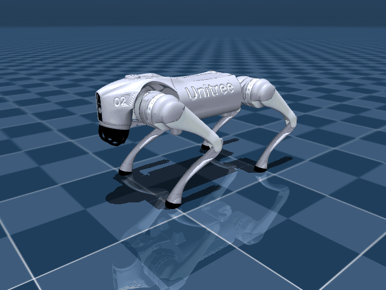

# 🐕 RL Quadruped Locomotion — MuJoCo + PPO

<div align="center">

**Train a Unitree Go2 quadruped robot to walk using reinforcement learning in MuJoCo**

[](https://python.org)
[](https://mujoco.org)
[](LICENSE)

<!-- TODO: Replace with your trained robot GIF -->
<!--  -->

</div>

---

## 📌 Overview

This project implements locomotion control for the [Unitree Go2](https://www.unitree.com/go2/) quadruped robot using **Proximal Policy Optimization (PPO)** in the **MuJoCo** physics simulator. Inspired by [Argo-Robot/quadrupeds_locomotion](https://github.com/Argo-Robot/quadrupeds_locomotion) (which uses the Genesis simulator), this work independently migrates the approach to the industry-standard MuJoCo platform and adds several novel contributions.

### Key Contributions

| # | Contribution | Description |
|---|---|---|
| 🔄 | **Platform Migration** | Migrated from Genesis to MuJoCo with standard Gymnasium API |
| 🧪 | **Reward Ablation Study** | Systematic analysis of 6 reward components' impact on gait quality |
| 🏔️ | **Terrain Curriculum** | Progressive terrain difficulty (flat → slopes → stairs → rough) |
| 🎲 | **Domain Randomization** | Friction, mass, latency, sensor noise randomization for sim-to-real |
| 📊 | **Multi-Algorithm Comparison** | PPO vs SAC vs TD3 performance comparison |

---

## 🏗️ Architecture

```
                 ┌─────────────┐
                 │  Commands   │ vx, vy, wz, height
                 └──────┬──────┘
                        │
                 ┌──────▼──────┐
    ┌────────────│   Policy    │────────────┐
    │            │ (Actor-     │            │
    │            │  Critic NN) │            │
    │            └──────┬──────┘            │
    │     48-dim obs    │   12-dim action   │
    │                   │   (residual pos)  │
    │            ┌──────▼──────┐            │
    │            │  PD Control │            │
    │            │  τ = Kp·e   │            │
    │            │    - Kd·ė   │            │
    │            └──────┬──────┘            │
    │                   │                   │
    │            ┌──────▼──────┐            │
    └───────────►│   MuJoCo    │◄───────────┘
                 │  Simulation │
                 │  (Go2 MJCF) │
                 └─────────────┘
```

### Observation Space (48-dim)

| Component | Dimensions | Description |
|-----------|:----------:|-------------|
| Angular velocity | 3 | Base angular velocity (body frame) |
| Projected gravity | 3 | Gravity vector in body frame |
| Commands | 5 | [vx, vy, wz, height, jump] |
| Joint positions | 12 | Relative to default pose |
| Joint velocities | 12 | All 12 motor joints |
| Previous actions | 12 | Last step's actions |
| Jump phase | 1 | Jump indicator |

### Reward Design

| Reward | Scale | Purpose |
|--------|:-----:|---------|
| `tracking_lin_vel` | +1.0 | Track commanded forward/lateral velocity |
| `tracking_ang_vel` | +0.2 | Track commanded yaw rate |
| `lin_vel_z` | −1.0 | Penalize vertical bouncing |
| `base_height` | −50.0 | Maintain target body height |
| `action_rate` | −0.005 | Smooth motor commands |
| `similar_to_default` | −0.1 | Stay near default standing pose |

---

## 🚀 Quick Start

### 1. Installation

```bash
git clone https://github.com/YOUR_USERNAME/quadruped-rl-locomotion.git
cd quadruped-rl-locomotion
pip install -r requirements.txt
```

### 2. Train (PPO)

```bash
# Basic training (flat terrain)
python src/train.py --algo ppo --total_timesteps 2000000 --num_envs 4

# With domain randomization
python src/train.py --algo ppo --domain_rand --total_timesteps 2000000

# Using config file
python src/train.py --config configs/default.yaml --exp_name my_experiment
```

### 3. Evaluate

```bash
# Evaluate trained model
python src/evaluate.py --model logs/my_experiment/best_model.zip --save_gif

# Test with random policy (no training needed)
python src/evaluate.py --policy random --num_steps 200 --save_gif
```

### 4. Run on Kaggle/Colab

Open `notebooks/train_quadruped.ipynb` and run all cells. The notebook is self-contained with installation, training, and visualization.

---

## 📁 Project Structure

```
quadruped-rl-locomotion/
├── src/
│   ├── envs/
│   │   ├── quadruped_env.py    # MuJoCo Gymnasium environment
│   │   ├── rewards.py          # 14 modular reward functions
│   │   ├── terrain.py          # Terrain generator + curriculum
│   │   └── domain_rand.py      # Domain randomization module
│   ├── train.py                # Training script (PPO/SAC/TD3)
│   ├── evaluate.py             # Evaluation + video rendering
│   └── utils.py                # Utilities (logging, plotting)
├── configs/
│   ├── default.yaml            # Default hyperparameters
│   ├── reward_ablation.yaml    # Ablation experiment configs
│   └── terrain_curriculum.yaml # Terrain difficulty schedule
├── assets/unitree_go2/         # MuJoCo Go2 model (from menagerie)
├── notebooks/
│   └── train_quadruped.ipynb   # Kaggle/Colab notebook
├── scripts/
│   └── run_ablation.sh         # Batch ablation runner
└── results/                    # Training curves, videos, plots
```

---

## 🧪 Experiments

### Reward Ablation

Run all ablation experiments:

```bash
bash scripts/run_ablation.sh
```

This trains 7 variants (baseline + 6 ablations), each removing one reward component to measure its importance.

<!-- TODO: Add ablation results plot -->
<!--  -->

### Algorithm Comparison

```bash
python src/train.py --algo ppo --exp_name compare_ppo --total_timesteps 1000000
python src/train.py --algo sac --exp_name compare_sac --total_timesteps 1000000
python src/train.py --algo td3 --exp_name compare_td3 --total_timesteps 1000000
```

---

## 🔬 Technical Details

### Residual Action Design

Instead of predicting absolute joint positions, the policy outputs **residual adjustments** to a stable default pose:

```python
target_pos = default_standing_pos + action * 0.25
```

This simplifies exploration and prevents erratic movements during early training.

### Domain Randomization

For robust sim-to-real transfer, we randomize:
- **Friction**: floor coefficient ∈ [0.3, 1.2]
- **Mass**: base mass ×[0.8, 1.2]
- **Latency**: 0–2 step action delay
- **Sensor noise**: IMU and encoder Gaussian noise
- **External forces**: random pushes with P=0.5%

### Terrain Curriculum

| Training Progress | Terrain Type | Difficulty |
|:-:|---|---|
| 0–30% | Flat | Learn basic balance |
| 30–60% | Gentle slopes | Adapt to inclination |
| 60–80% | Stairs | Coordinate leg movement |
| 80–100% | Random rough | Full generalization |

---

## 📚 References

- Argo-Robot: [Making Quadrupeds Learning to Walk](https://github.com/Argo-Robot/quadrupeds_locomotion)
- Schulman et al.: [Proximal Policy Optimization](https://arxiv.org/abs/1707.06347) (2017)
- Kumar et al.: [RMA: Rapid Motor Adaptation](https://arxiv.org/abs/2107.04034) (2021)
- Rudin et al.: [Learning to Walk in Minutes](https://arxiv.org/abs/2109.11978) (2022)
- Tan et al.: [Sim-to-Real Quadruped Locomotion](https://arxiv.org/abs/1804.10332) (2018)
- Go2 model: [MuJoCo Menagerie](https://github.com/google-deepmind/mujoco_menagerie)

---

## 📄 License

MIT License. See [LICENSE](LICENSE) for details.

The Unitree Go2 MuJoCo model is from [mujoco_menagerie](https://github.com/google-deepmind/mujoco_menagerie) under BSD-3-Clause License.
